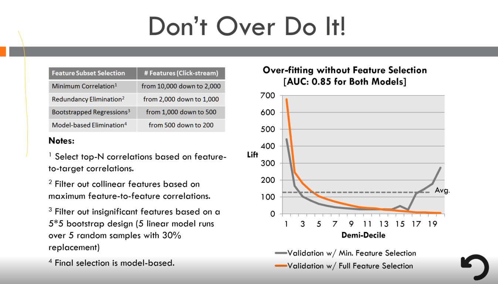

# feature_selection

### İsmail Parsa'nıın Sunumundaki Notlar

Solda sırasıyla feature seçmedeki adımlar bulunmakta.

1.) Min korelasyon thresholdu belirlenip (0,2 ya da 0,02 olabilir) bu eşik değerin altında olanlar atılır.
2.) Redundancy : Birbirine çok yakın featureları atmaca. 2 feature birbirine 0,85 oranında yakınsa targetla daha fazla korele olanı tut.
3.) Bootsrap Regression : Regresyon analizi kullanılarak resampling tekniği dediğimiz yani veriden 5 kere %40 gibi bir oranda (farklı oranlarda olabilir.) sample çekip 5 kere regresyon yapıp 5 i içinde 3 ünde önemli olmuş featurelarla devam etme.
4.) En sonda da modele sokup (3 defa) feature importance ı en yüksek ortak değişkenlerle devam ederek final modeli kurmak.

Sağdaki grafikte 2 ayrı modelin AUC değerleri gözükmekte turuncu kısımda yukardaki adımların hepsi uygulanmış gri kısımda da yukardaki 1.adımdan sonrası yapılmamış. Lift curve'e bakınca iki model arasındaki fark gözükmekte.

